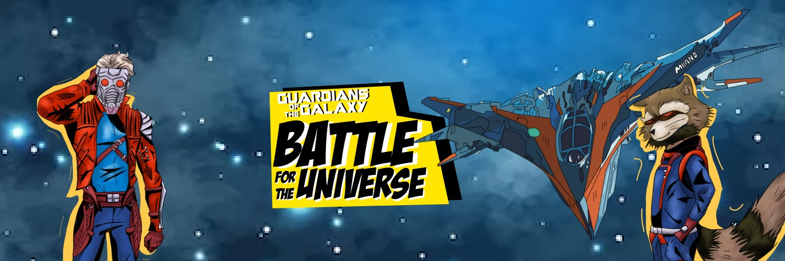

# Guardians of the Galaxy: Battle for the Universe

## Description

Guardians of the Galaxy: Batle for the Universe is a twin-stick bullet hell roguelite. Fight the phalanx beside Star Lord and Rocket to reach to the top, where Ultron, their leader, awaits for a final fight.
Developed by Playground Studio, this game is based in the marvel comics, we wish you have fun while playing it!

## Pixel Playground

Pixel Playground is a group of 25 CITM students who have come together to create a video game as part of their 3rd year Project. Using our own engine during the past semester we developed a bullet hell top-down shooter video game based on the Guardians of the Galaxy. 

With you all, Guardians of the Galaxy: Battle for the Universe!

## Trailer

  

## More Info on our website

https://pixelplaygroundgam.wixsite.com/pixelplayground/the-studio

## Download
https://zarodev.itch.io/guardians-of-the-galaxy-battle-for-the-universe
